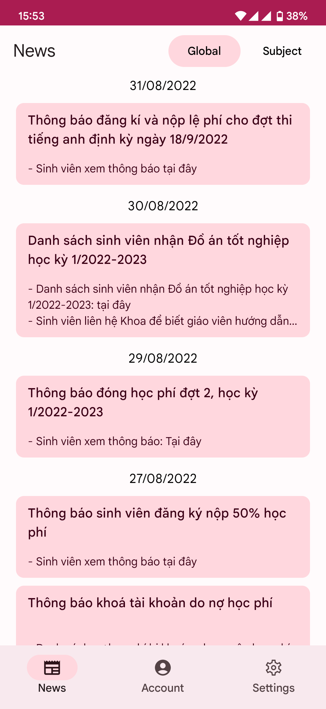
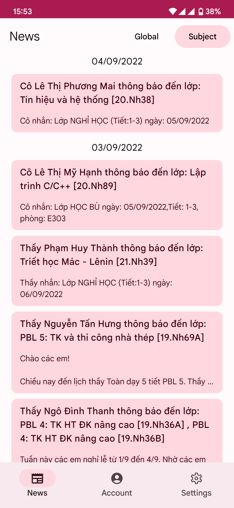
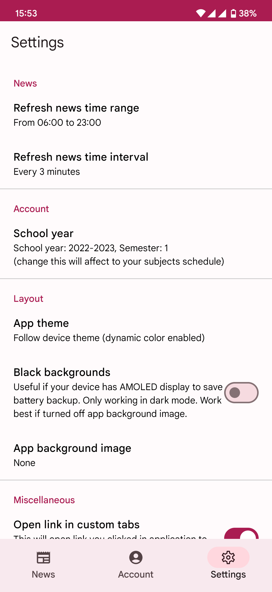
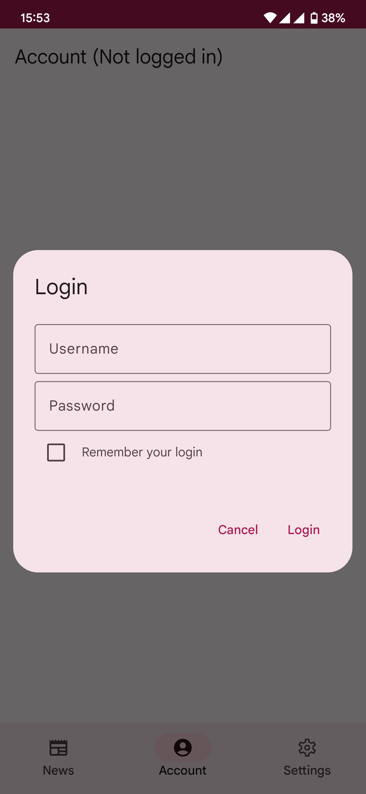
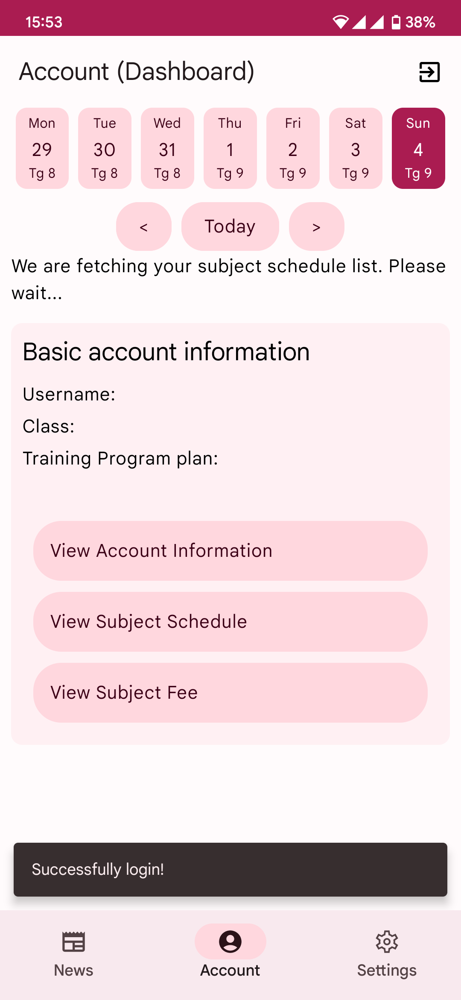
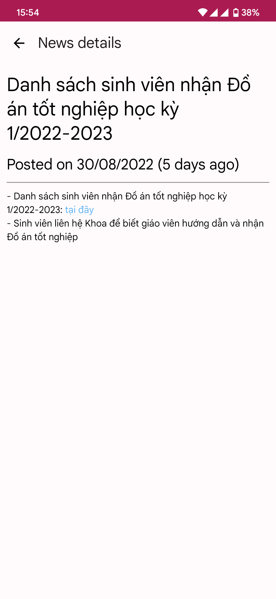

# DUT Notify - App for Android
Just a Android app to view news from sv.dut.udn.vn, but optimized for a better experience for users on mobile instead of web.


# Features & Screenshots?
- These screenshot will get you to app summary. Just navigate to [screenshot](#screenshot) open images to view details.

# Downloads
- Navigate to release (at right of this README) or click [here](https://github.com/ZoeMeow5466/DUTNotify/releases) to download app.

# Build app yourself
- If you open project with Android Studio, make sure your IDE support [Gradle 7.4.2 or latest](https://gradle.org/releases/). This can be fixed by upgrading your IDE. After that, just build and run app normally as you do with another Android project.

- If you want to build app without IDE, just type command as you build another gradle project (note that you need to install [Gradle 7.4.2 or latest](https://gradle.org/releases/) first, otherwise this didn't work):

```
Build: gradlew build
For Powershell: ./gradlew build
```

# FAQ

### Where can I found app changelog?
- https://github.com/ZoeMeow5466/DUTNotify/commits. You will need to change branch if you want to view changelog for beta/alpha/draft version.

### Why some news in application is different from sv.dut.udn.vn?
- This app is only crawl data from sv.dut.udn.vn (web) and modify to friendly view. To make sure you can read news cache when you are offline, app will need save current news and compare to web. So, if news from web deleted, news in app will still here.

### So, I will need to delete old news cache. What should I do?
- Navigate to settings, find application and delete app cache. App needs to be closed to completely cleared news cache.

### I'm got issue with this app. Which place can I retroduce issue for you?
- You can report issue via Issue tab on this repository. Thank you for your support!

# Copyright?
- This project - DUT Notify - is not affiliated with Da Nang University of Technology. 
- DUT, Da Nang University of Technology, web materials and web contents are trademarks and copyrights of Da Nang University of Technology school.

# Implementations
- Material You (Material3) on Android 12 and up
- [Google Accompanist](https://github.com/google/accompanist)
- [Google Gson](https://github.com/google/gson)
- [JSoup](https://github.com/jhy/jsoup/)
- [KotlinX-DateTime](https://github.com/Kotlin/kotlinx-datetime)
- [Retrofit](https://github.com/square/retrofit)

# Screenshot








